# Global Layoffs — SQL Data Cleaning Project

A step-by-step data cleaning workflow built in **MySQL 8.0**, turning a messy, real-world dataset into a clean, reliable table that's ready for analysis.


---

## 📌 What This Project Is About

Raw data almost never comes clean. This dataset had duplicate rows, inconsistent spelling, missing values, and text stored in the wrong format — the kind of problems that would quietly mess up any chart or report built on top of it. This project walks through **every step taken to fix those problems**, using only SQL, so the final table can actually be trusted.

**Tools & Concepts Used**
- **MySQL 8.0**
- **Window Functions** — specifically `ROW_NUMBER()`, used to find duplicate rows
- **Self-Joins** — using a table to fill in its own missing information
- **CTEs (Common Table Expressions)** and the specific MySQL 8.0 limitation I ran into while using them
- **Staging Tables** — working on a copy of the data instead of the original
- **Data Type Conversion** — turning text into a real date format
- **Basic Schema Cleanup** — removing columns and rows that aren't useful anymore

**Reference script:** [`global_layoffs_cleaning.sql`](./global_layoffs_cleaning.sql)

---

## 🗂️ Table of Contents

1. [Removing Duplicates (Trickier Than It Sounds)](#1-removing-duplicates-trickier-than-it-sounds)
2. [Cleaning Up and Standardizing the Data](#2-cleaning-up-and-standardizing-the-data)
3. [Filling in Missing Data (Airbnb Example)](#3-filling-in-missing-data-airbnb-example)
4. [Removing Unnecessary Rows and Columns](#4-removing-unnecessary-rows-and-columns)
5. [Workflow Summary](#-workflow-summary)

---

## 1. Removing Duplicates (Trickier Than It Sounds)

**The problem:** the raw dataset had duplicate rows in it, and duplicates mean the numbers get counted twice — which throws off any totals or trends later on.

### Why This Was Harder Than a Normal Duplicate Check

Here's the catch: this table **did not have a unique ID column** — no `layoff_id`, no `employee_id`, nothing that uniquely identifies each row. If a column like that already existed, removing duplicates would be simple: just group by the ID and delete the extras.

Since there was no ID to rely on, I had to **create a temporary numbering system myself** using a SQL window function:

```sql
ROW_NUMBER() OVER (PARTITION BY ...)
```

In plain terms, this function looks at the data, groups rows that look similar, and gives each one a number (1, 2, 3...) inside that group. If a row shows up more than once, it gets a number higher than 1 — which is exactly how I could tell which rows were true duplicates.

### Step 1.1 — My First Attempt Wasn't Quite Right

At first, I only checked a handful of columns to find duplicates:

```sql
SELECT *,
       ROW_NUMBER() OVER (
           PARTITION BY company, industry, total_laid_off, percentage_laid_off, `date`
       ) AS row_num
FROM layoffs_staging;
```

This flagged companies like **`Oda`** and **`Terminus`** as possible duplicates. But when I checked those rows manually, they turned out to be **real, separate entries** — they just happened to share the same values in those few columns. If I had deleted them, I would have lost real data.

**The fix:** check **all 9 columns** at once — `company`, `location`, `industry`, `total_laid_off`, `percentage_laid_off`, `date`, `stage`, `country`, and `funds_raised_millions`. A row only gets flagged as a duplicate now if it matches *every single column*, which is a much safer way to be sure:

```sql
SELECT *
FROM (
    SELECT company, location, industry, total_laid_off,
           percentage_laid_off, `date`, stage, country, funds_raised_millions,
           ROW_NUMBER() OVER (
               PARTITION BY company, location, industry, total_laid_off,
                            percentage_laid_off, `date`, stage, country, funds_raised_millions
           ) AS row_num
    FROM layoffs_staging
) AS duplicates
WHERE row_num > 1;
```

**Checking a Few Columns (Risky) vs. Checking All Columns (Safe)**

| Checking Only a Few Columns | Checking All 9 Columns |
|---|---|
| 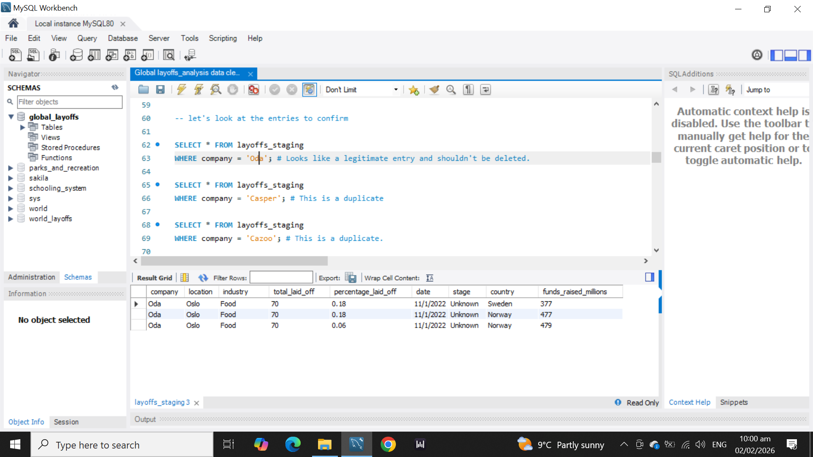 | 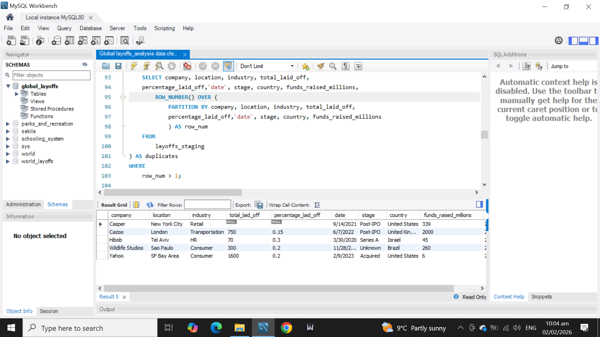 |

> **A Real Roadblock — MySQL Won't Let You Delete From a CTE**
> Once I found the duplicates, my first instinct was to delete them straight from the CTE (the temporary result I used to run the `ROW_NUMBER()` query). That doesn't work in MySQL 8.0 — **you simply can't run `DELETE` or `UPDATE` directly on a CTE.** On top of that, the `row_num` column only exists inside that temporary query — it's not a real column in the actual table, so I couldn't filter on it there either.
> ```sql
> WITH DELETE_CTE AS (
>     SELECT *, ROW_NUMBER() OVER (PARTITION BY ...) AS row_num
>     FROM layoffs_staging
> )
> DELETE FROM DELETE_CTE
> WHERE row_num > 1; -- ❌ MySQL blocks this — CTEs aren't updatable
> ```

### Step 1.2 — The Workaround That Actually Worked

Instead of trying to delete from a temporary result, I **created a brand-new, real table** (`layoff_staging2`) that includes the `row_num` values as an actual column. Once it's a real column in a real table, deleting the duplicates becomes easy:

```sql
CREATE TABLE layoff_staging2 AS
SELECT *,
       ROW_NUMBER() OVER (
           PARTITION BY company, location, industry, total_laid_off,
                        percentage_laid_off, `date`, stage, country, funds_raised_millions
       ) AS row_num
FROM layoffs_staging;

-- MySQL blocks certain deletes by default as a safety net — turning it off just for this step
SET SQL_SAFE_UPDATES = 0;

DELETE FROM layoff_staging2
WHERE row_num > 1;

-- Turning the safety net back on right after
SET SQL_SAFE_UPDATES = 1;
```

From this point on, every cleaning step in this project runs on `layoff_staging2` — the original raw data stays untouched as a backup, in case anything needs to be double-checked later.

**Duplicates Found vs. Duplicates Removed**

| Duplicates Flagged (`row_num > 1`) | Duplicates Gone (After Deleting) |
|---|---|
|  | 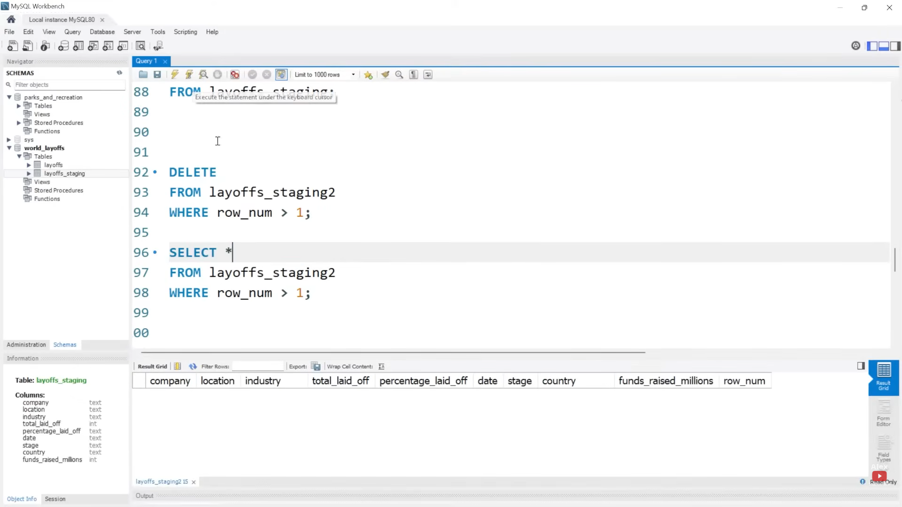 |

---

## 2. Cleaning Up and Standardizing the Data

**The problem:** even after removing duplicates, the data had small inconsistencies — extra spaces, different spellings for the same thing, and dates saved as plain text instead of real dates. These small issues can cause big problems later, like the same company being counted as two different groups. To establish a clean foundation for reliable reporting, I addressed these inconsistencies column by column to unify the schema.

### 2.1 Standardizing the Company Column by Removing Extra Spaces

**The Problem:** Text data brought in from spreadsheets or CSV files often carries invisible extra spaces at the start or end of a word — for example, `" Google"` instead of `"Google"`. We can't always see this just by looking at it, but SQL can. If it's not fixed, SQL treats `" Google"` and `"Google"` as two completely different companies, which means one company's layoffs would get split across two separate rows instead of being grouped together correctly.

**The Solution:** This phase used the `TRIM()` function to automatically strip away any hidden leading or trailing spaces across the **entire** `company` column in one go — no need to check row by row:

```sql
UPDATE layoff_staging2
SET company = TRIM(company);
```

`TRIM()` simply removes extra spaces from the beginning and end of a piece of text, keeping every company name clean and consistent.

| Before | After |
|---|---|
| 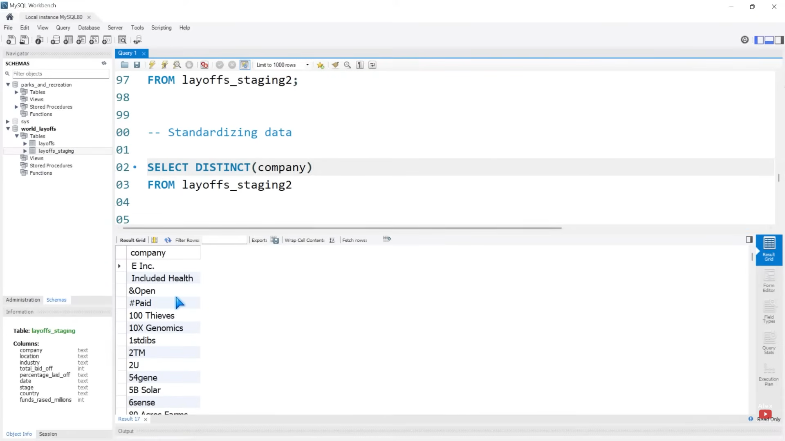 | 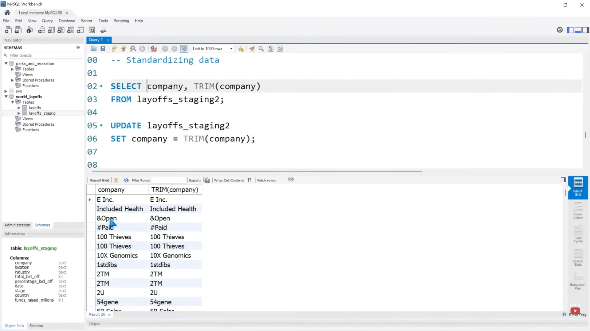 |

### 2.2 Unifying Multiple Variations of the Same Industry Name

**The Problem:** When data is entered by hand (or pulled together from different sources), the same thing often ends up labeled in several different ways. In this dataset, the industry column has variations in same company names like **`Crypto`**, **`Crypto Currency`**, and **`CryptoCurrency`** — three separate labels all describing the exact same industry. SQL has no way of knowing these are the same thing on its own, so it treats them as three unrelated categories. That breaks any report or chart that groups layoffs by industry, since the real Crypto totals end up split into three smaller, incomplete pieces.

**The Solution:** This phase involved finding every variation of the label and updating them all to one single, official name — `'Crypto'` — so the data rolls up cleanly into one accurate group:

```sql
UPDATE layoff_staging2
SET industry = 'Crypto'
WHERE industry IN ('Crypto Currency', 'CryptoCurrency');
```

| Before (Three Different Labels) | After (One Consistent Label) |
|---|---|
| 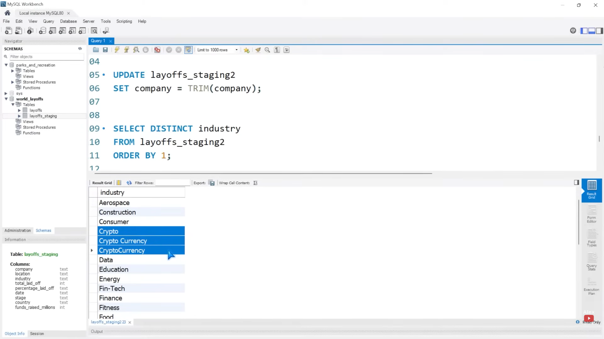 | 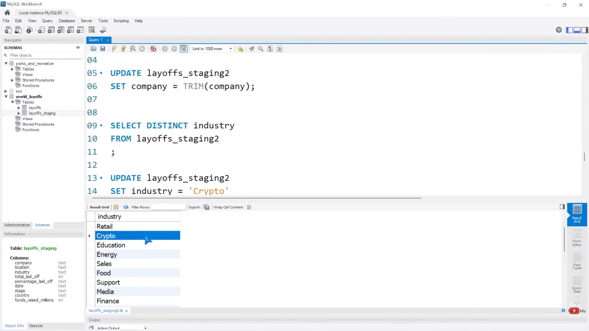 |

### 2.3 Fixing the Country Column by Removing Trailing Periods

**The Problem:** Small typo-style errors — like a stray period accidentally left at the end of a name — are easy for a human to overlook but cause real problems for a database. If some rows say `Country` and others say `Country.`, any filter, map, or "group by country" query will treat them as two different places, quietly skewing your results.

**The Solution:** To resolve this efficiently across the entire dataset, I targeted the country column using the TRIM(TRAILING '.' FROM country) function.The clearest example in this dataset was **United States** — some rows had `United States`, while others had `United States.` with a trailing period. To fix this safely (without risking damage to the actual country name), the `TRIM(TRAILING '.' FROM country)` function was used, which only removes a period if it's sitting at the very end of the text:

```sql
UPDATE layoff_staging2
SET country = TRIM(TRAILING '.' FROM country);
```

| Before | After |
|---|---|
| 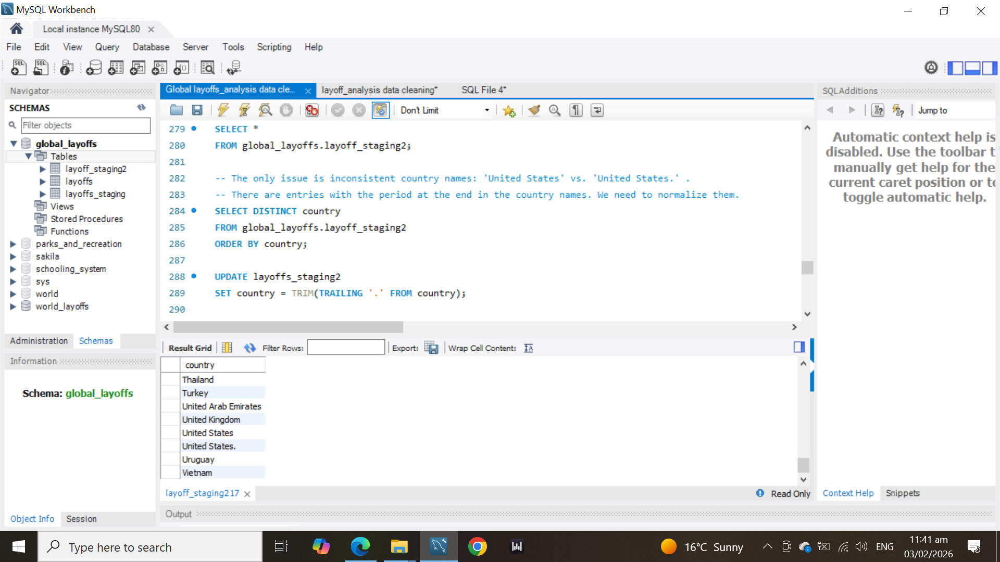 | 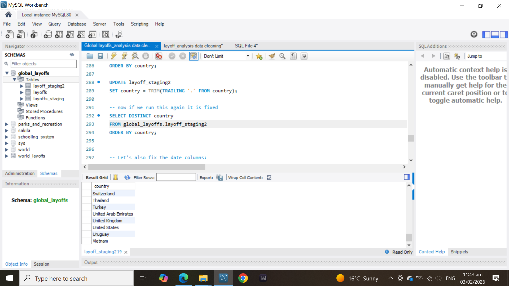 |

### 2.4 Hardening the Schema by Converting the Date Column From Text to Date Type

**The Problem:** When data is imported from a flat file (like a CSV), date values almost always enter the database as plain **text** strings (for example, `12/16/2022`) rather than true date formats. While it is entirely possible to adjust and correct this column's data type using the import wizard settings during the initial data load, I intentionally chose to leave it as text so that I could demonstrate how to clean and convert it manually using SQL queries. 

Because it was left as raw text, SQL initially viewed it as just a string of characters instead of a calendar date. This meant no real time-based analysis could be run—there was no way to sort chronologically, filter by specific date ranges, or track layoffs by month or year until the formatting was fixed.

**The Solution:** This phase was handled in two steps.

**Step 1 — Teach SQL how to read the text as a real date**, using `STR_TO_DATE()` to tell it exactly how the existing text is formatted (month/day/year):

```sql
UPDATE layoff_staging2
SET `date` = STR_TO_DATE(`date`, '%m/%d/%Y');
```

**Step 2 — Permanently change the column's data type**, using the DDL command `ALTER TABLE ... MODIFY COLUMN` so the column is no longer just text that *looks* like a date — it officially becomes a true `DATE` type in the database:

```sql
ALTER TABLE layoff_staging2
MODIFY COLUMN `date` DATE;
```

| Date Values Before Reformatting | Date Values After Reformatting |
|---|---|
| 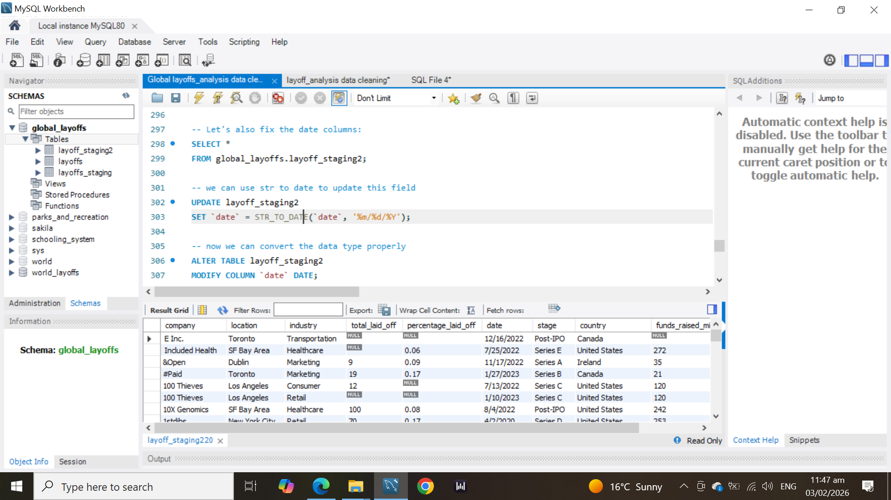 | 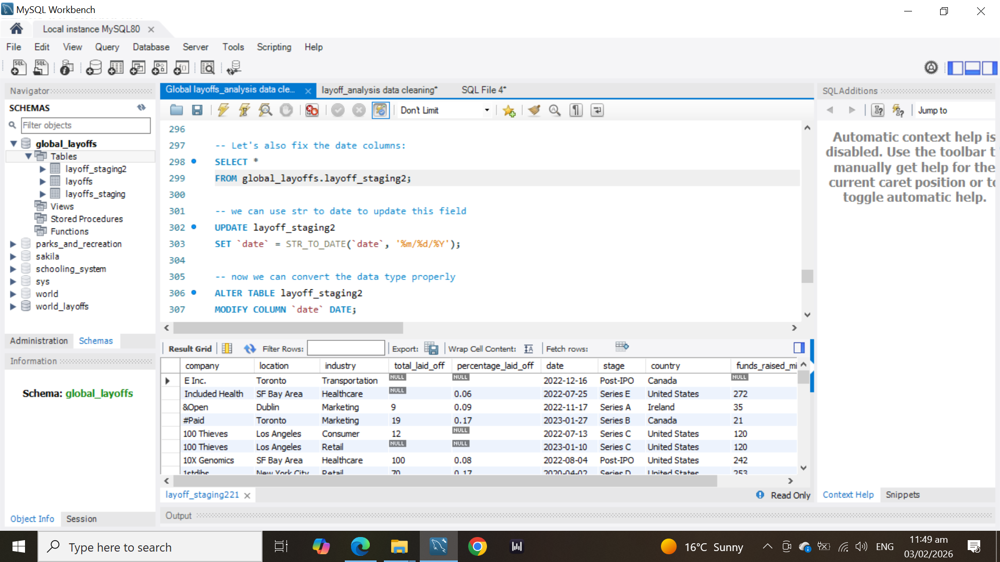 |

| Column Type Before (Text) | Column Type After (Date) |
|---|---|
| 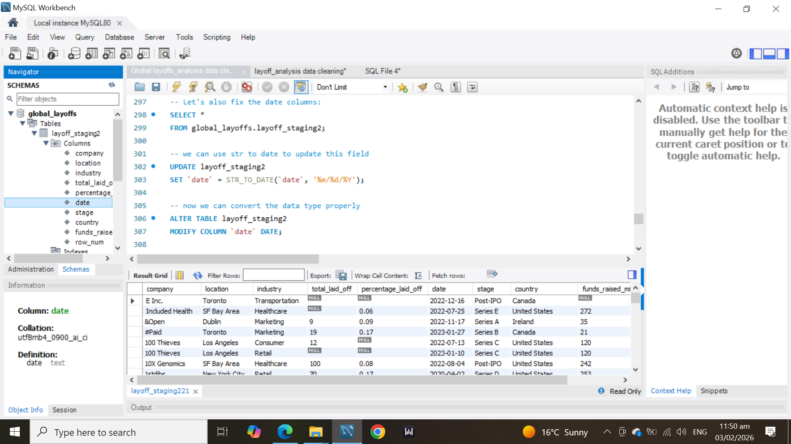 | 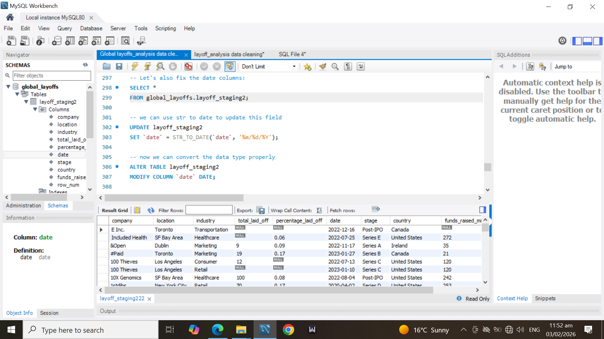 |

---

## 3. Filling in Missing Data (Airbnb Example)

**The problem:** some companies — including **Airbnb** — had a blank `industry` value on one row, even though that *same company* had the correct industry filled in on another row elsewhere in the table.

### 3.1 Turning Blanks Into Proper `NULL` Values

Before trying to fix anything, I converted every blank (`''`) value into a real `NULL`. In SQL, a blank text value and a true `NULL` aren't treated the same way — converting them to `NULL` first makes every check and comparison after this step behave the way you'd expect:

```sql
UPDATE global_layoffs.layoff_staging2
SET industry = NULL
WHERE industry = '';
```

| Blank Industry Value | Proper `NULL` Value |
|---|---|
| 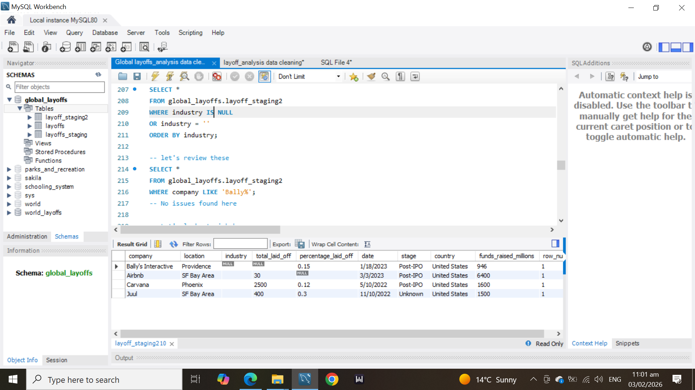 | 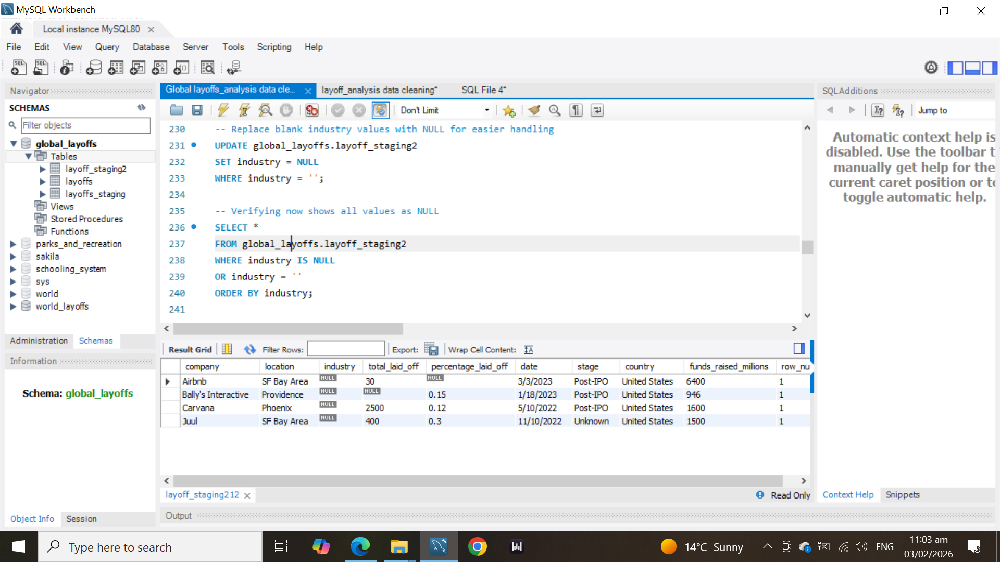 |

### 3.2 Using a Self-Join to Fill in the Gaps

**Why it matters:** rather than manually looking up and typing in each missing industry by hand, I used a **self-join** — where a table is joined to *itself* — to let the table fill in its own blanks automatically.

Here's the idea in plain English: *"For every row where the industry is missing, check if there's another row for the same company that does have an industry filled in — and if so, copy it over."*

```sql
UPDATE layoff_staging2 t1
JOIN layoff_staging2 t2
    ON t1.company = t2.company
SET t1.industry = t2.industry
WHERE t1.industry IS NULL
  AND t2.industry IS NOT NULL;
```

This one query fixes every matching row at once — no manual research needed, even across thousands of rows. For example, for **Airbnb**, one row already had `industry = 'Travel'`, while a second row had a missing industry. The self-join found the match and filled it in automatically.

| Airbnb Row Before | Airbnb Row After the Self-Join |
|---|---|
| 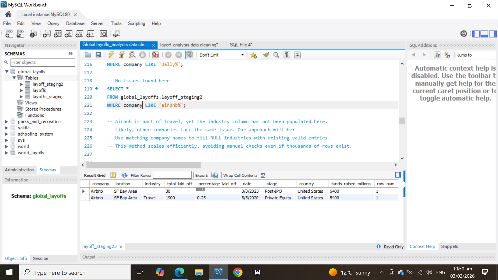 | 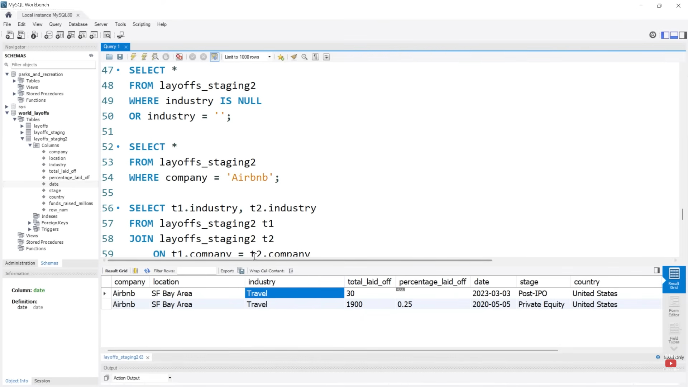 |

> **A quick sanity check:** after running this, only **Bally's Interactive** was still left with a missing industry — because it didn't have a second row anywhere in the table to copy the value from. That actually confirms the self-join worked exactly as intended: it fills in what it *can* find, and correctly leaves alone what it *can't*.

---

## 4. Removing Unnecessary Rows and Columns

**The problem:** a clean table isn't just about fixing values — it also means getting rid of rows and columns that don't add anything useful before calling the data "done."

### 4.1 Removing Rows With No Useful Layoff Data

Some rows had `NULL` in **both** `total_laid_off` and `percentage_laid_off` — meaning there was no way to tell how many people were actually laid off. Since neither number was available, these rows weren't going to help with any future analysis, so they were removed. Rows that were missing just *one* of the two values were kept, since the other value still tells us something useful.

```sql
DELETE FROM global_layoffs.layoff_staging2
WHERE total_laid_off IS NULL
  AND percentage_laid_off IS NULL;
```

### 4.2 Removing the Helper Column We Created

As the `row_num` column from **Section 1**? It was only ever there to help find and remove duplicates. Now that the duplicates are gone, it's just extra clutter, so it gets dropped:

```sql
ALTER TABLE layoff_staging2
DROP COLUMN row_num;
```

---

## 🔁 Workflow Summary

| Step | What I Did | How |
|---|---|---|
| **1. Remove Duplicates** | Get rid of exact duplicate rows, without accidentally deleting real, unique entries | `ROW_NUMBER()` across all 9 columns + a staging table (since the raw data had no unique ID) |
| **2. Standardize the Data** | Fix inconsistent spelling, extra spaces, and text that should be dates | `TRIM()`, `TRIM(TRAILING ...)`, `STR_TO_DATE()`, `ALTER TABLE ... MODIFY COLUMN` |
| **3. Fill in Missing Data** | Recover missing industry values using other rows for the same company | Blank → `NULL` cleanup, then a self-join |
| **4. Final Cleanup** | Remove rows and columns that no longer serve a purpose | `DELETE`, `ALTER TABLE ... DROP COLUMN` |

Every change in this project was made on a **copy** of the raw data (`layoff_staging2`), so the original import was never touched and could always be used to double-check my work.

---

## 🤝 Credits & Acknowledgments

This project was built following the data cleaning methodology taught by **Alex The Analyst**, an invaluable community resource for mastering SQL data pipelines.
* **Original Content:** [Alex The Analyst YouTube]((https://youtu.be/4UltKCnnnTA?si=GkSUVPEkL83K5Cg6))

---

### 📂 Project Artifacts
* **Complete SQL Pipeline:** Code for the full data cleaning script can be found in [`global_layoffs_cleaning.sql`](./global_layoffs_cleaning.sql).

**Implemented By:** Umair Asad  
🔗 [GitHub Portfolio](https://github.com/Umair-Asad2001) · ✉️ [Connect on LinkedIn]([https://www.linkedin.com](https://www.linkedin.com/in/umair-data/))
